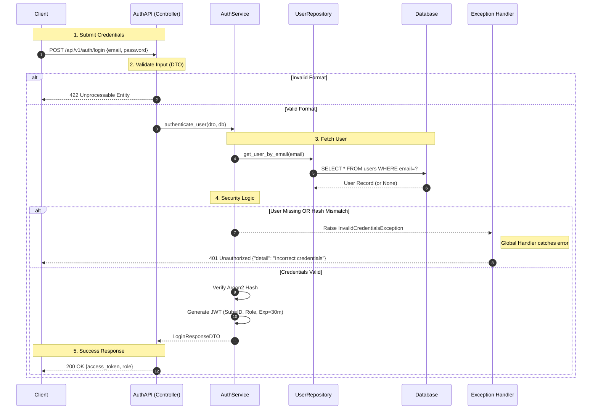
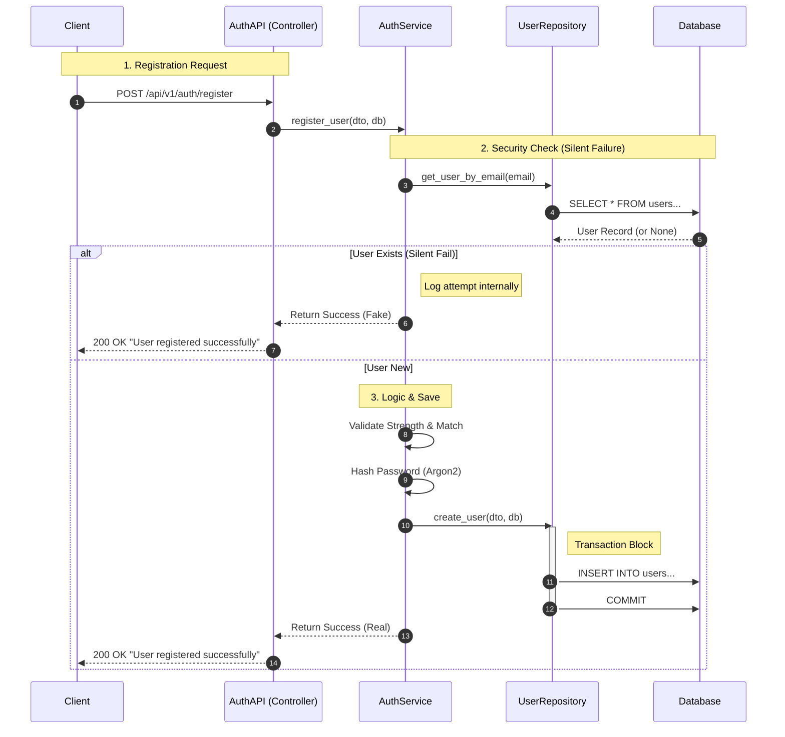

# Traffic System Authentication Design (UC-01 & UC-02)

## 1. Architectural Overview
This system implements a **Synchronous Layered Architecture** using Python (FastAPI). It strictly enforces separation of concerns to ensure scalability, security, and maintainability.

### Key Patterns Used
* **Layered Architecture:** Controller (`api`) → Service (`service`) → Repository (`repository`).
* **DTO Pattern:** Pydantic models for strict input/output validation.
* **Dependency Injection:** Services and Repositories are injected using FastAPI `Depends`.
* **Security Standards:** * **Argon2** hashing for password storage.
    * **JWT** (JSON Web Tokens) for stateless session management.
    * **Silent Failure:** Registration endpoints return generic success messages to prevent "User Enumeration" attacks.
* **Unit of Work:** Database sessions are managed via the Repository layer (for writes) or passed down (for reads) to ensure integrity.

---

## 2. Login Workflow (UC-01)
The login process follows a linear, secure flow:

1.  **Request:** User submits credentials (`email`, `password`) via HTTP POST.
2.  **Validation Layer:** The API validates the data format (e.g., valid email structure).
3.  **Repository Layer:** The system queries the database for the user record using the email.
4.  **Service Layer (Security):**
    * *User Check:* If user is missing, raise `InvalidCredentialsException`.
    * *Password Check:* Verify input against stored hash using **Argon2**.
    * *Token Gen:* If valid, create a JWT (signed, expires in 30m).
5.  **Response:** The system returns the Access Token and User Role.
6.  **Error Handling:** Any logic failure raises a Python Exception, which the global handler catches to return a secure 401 JSON response (preventing user enumeration).

### Login Sequence Diagram

## UC-02: User Registration Design

The registration process uses a **Silent Failure** strategy (Security Best Practice) to protect user privacy and prevent email enumeration attacks.

1.  **Request:** User submits registration details (`email`, `password`, `confirm_password`) via HTTP POST.
2.  **Validation Layer:** * **API Layer:** Validates data format (e.g., proper email structure) using Pydantic.
    * **Service Layer:** Validates business rules (Password Strength, Password Confirmation match).
3.  **Duplication Check (Security):** The system checks if the email already exists in the database.
4.  **Silent Failure Strategy:**
    * **If User Exists:** The system logs the attempt internally (for auditing) but returns a **200 OK** "Success" message to the client. This prevents attackers from guessing which emails are registered.
    * **If User is New:** The system proceeds to creation.
5.  **Creation Logic:**
    * Password is hashed using **Argon2** (via `passlib`).
    * `UserRepository` creates the new user entity.
6.  **Persistence (Unit of Work):** * The Repository executes the `INSERT` and `COMMIT` within a strict transaction block (`try/except/rollback`).
7.  **Response:** Returns 200 OK "User registered successfully".

---

### 3. Register Sequence Diagram

